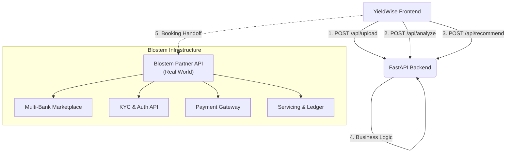

# YieldWise (Blostem Hackathon MVP)

YieldWise is an AI-powered financial coach that helps users move from expense tracking to wealth-building. It analyzes transaction data, identifies a personalized safe-to-save surplus, and recommends suitable fixed deposit options. The MVP demonstrates the user-facing discovery and recommendation layer, while Blostem represents the downstream FD infrastructure layer for marketplace access, KYC, payments, booking, and servicing in production.

---

## 🛠 Golden Path Demo Script

Follow these 6 steps to experience the complete end-to-end integration:

1. **Launch the Interface**: Open the Next.js app to see the Landing Page.
2. **Upload CSV**: On the platform, bypass manual entry by uploading the mock transaction CSV (Demo data built-in).
3. **Analyze Dashboard**: View the dynamic Recharts pie/bar charts tracking total spending, income, and emergency buffering logic identifying the "safe-to-save" amount.
4. **Discover the Recommendation**: See the "Why this FD?" section offering a personalized tenure and amount matching the user's spending volatility score.
5. **Chat Explanation**: Launch the integrated AI Chat coach and ask "Why a 6-month FD instead of 1 year?" for a context-aware defense of the recommendation.
6. **Blostem Handoff**: Proceed to the Booking flow screen. Click "Confirm" to reach the handoff simulation where the MVP simulates the booking handoff; in production, the recommendation payload would be forwarded into Blostem’s FD infrastructure for issuer selection, KYC, payments, booking, and servicing.

---

## 🏗 Architecture & Blostem Integration

The MVP uses a heavily decoupled Client/Server architecture to represent how a consumer-facing FinTech operates on top of Blostem's infrastructure. (The Blostem handoff is simulated in this MVP.)



## Current MVP vs Production Plan

| Layer | Current MVP | Production Plan |
| :--- | :--- | :--- |
| **Transaction Input** | Mock CSV upload and built-in sample transactions | Bank/account data ingestion or partner-led financial data sources |
| **Expense Intelligence** | Heuristic parser and categorizer in FastAPI | Better classification pipeline with learned models and transaction normalization |
| **Recommendation Engine** | Rule-based FD suggestion based on surplus and volatility | Personalized scoring engine using live product catalog, goal timelines, and risk-aware user behavior |
| **Chat / Guidance** | Context-aware rules-based financial coach | RAG-based assistant using FD docs, issuer terms, FAQs, and user context |
| **FD Catalog** | Mock catalog in local backend | Live product and issuer inventory via Blostem integration |
| **Booking Flow** | Simulated handoff screen | Real handoff into Blostem white-label FD journey for KYC, payment, and servicing |
| **Post-booking state** | Static success screen | Real booking status, servicing, maturity alerts, and portfolio sync through Blostem rails |

YieldWise is intentionally built as the AI discovery and recommendation layer that sits above Blostem’s FD infrastructure. In the MVP, transaction ingestion, recommendation, and booking handoff are simulated with mock data so the end-to-end user journey can be demonstrated clearly. In production, the same UX would connect to Blostem’s live FD infrastructure for multi-bank marketplace access, KYC orchestration, payment rails, booking workflows, and servicing.

## RAG & Future Stack

The current MVP uses structured rules and a lightweight contextual coach for speed and demo reliability. The production design adds a planned RAG layer so the assistant can answer using grounded financial context instead of generic LLM responses. The retrieval layer would ingest Blostem product documentation, issuer details, tenure/rate metadata, FAQ content, financial literacy material, and user-specific recommendation context before generating answers.

- **Vector DB**: pgvector or Qdrant.
- **Knowledge sources**: Blostem FD docs, issuer notes, support FAQs, user recommendation history.
- **LLM role**: explain “why this FD,” compare tenure choices, answer financial literacy questions.
- **Goal**: grounded, explainable responses rather than generic chatbot output.

---

## 🚀 API Endpoints

The FastAPI backend securely orchestrates logic using strict Pydantic V2 schemas.

| Method | Endpoint | Description |
| :--- | :--- | :--- |
| `POST` | `/api/upload` | Reads CSV text from frontend, parsing & categorizing spending via a heuristic keyword engine. |
| `POST` | `/api/analyze` | Calculates safety buffers and volatility index to derive the `safeToSave` amount safely. |
| `POST` | `/api/recommend` | Maps the safety buffer and stability scores against the active `catalog.py` to yield FDProducts. |
| `POST` | `/api/chat` | Contextually responds to financial inquiries using current user balance buffers. |

---

## 💻 How to Run Locally

Both backend and frontend build completely from scratch out-of-the-box. Ensure you have Python and Node installed.

### 1. Start the Backend (FastAPI)
```bash
cd backend
python -m venv .venv

# Windows activation
.\.venv\Scripts\activate
# Mac/Linux activation
# source .venv/bin/activate

pip install -r requirements.txt
python -m uvicorn main:app --reload
```
*(Runs on `http://localhost:8000`)*

### 2. Start the Frontend (Next.js)
In a secondary terminal tab:
```bash
cd frontend
npm install
npm run dev
```
*(Runs on `http://localhost:3000`)*

---

## Why this fits Blostem

In a production deployment, the recommendation payload from YieldWise would be forwarded into Blostem’s FD infrastructure for issuer selection, KYC orchestration, payment rails, booking workflows, and post-booking servicing. YieldWise would remain the user-facing intelligence layer, while Blostem would manage the regulated execution layer underneath.
