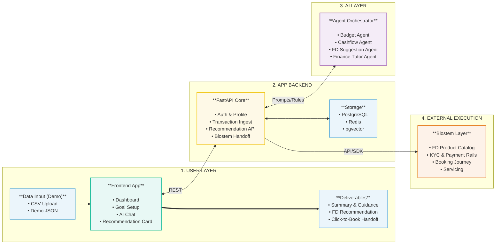

# Hackathon MVP System Design

**AI money coach on top of Blostem.**
The app understands user spending, explains savings choices in simple words, recommends a suitable fixed deposit, and then hands the user into Blostem’s booking rails.

*Build fast • Demo clearly • Keep banking external*

---

## Architecture Flow

---

## 1. User Layer (Frontend App)
The interactive interface where the user navigates their financial journey.
- **Dashboard**: Monitors income, spending, and the safe-to-save surplus.
- **Goal setup**: Tracks life objectives like emergency funds, trips, or gadgets.
- **AI chat**: Interactive financial tutor ("*Can I save 5k this month?*").
- **Recommendation card**: Dynamic FD suggestion + Book FD CTA.
- **Tech Stack**: Next.js, TypeScript, Tailwind.

### Input for Demo
- **Data Sources**: CSV upload, manual expense entry, built-in demo JSON dataset.

## 2. App Backend (FastAPI Core)
The orchestration engine that handles standard API transactions and connects the intelligence layer to the UI.
- **Components**:
  - Auth and user profile tracking
  - Transaction ingestion and cleanup pipeline
  - Recommendation API
  - Chat API
  - Blostem Hand-off endpoint
- **Tech Stack**: FastAPI, Python, REST APIs.

### Infrastructure & Storage 
**In MVP (Hackathon scope):**
- Entirely **stateless and in-memory**. Zero database setup required to guarantee seamless judging deployment.

**Production Vision:**
- **PostgreSQL**: Stores users, transactions, goals, recommendations, and chat history.
- **Redis**: Caches product list, tracks short-lived session states, and holds fast agent context.
- **pgvector**: Holds finance FAQs, FD explainers, and product metadata for the tutor agent (RAG).

## 3. AI Layer (Agent Orchestrator)
One router coordinates a localized team of simple, distinct agents.

**In MVP (Hackathon scope):**
- Built using **pure heuristic Python classes** simulating agent behaviors. 
- Guarantees 0 latency, 100% demo uptime, and requires no external API keys.

**Production Vision:**
- Migrate to LangGraph + real LLMs for dynamic reasoning instead of one monolithic, complicated LLM prompt.

- **Budget Agent**: Categorizes raw spending into standardized buckets (rent, food, travel, shopping, bills).
- **Cashflow Agent**: Calculates the accurate "safe-to-save" amount after assessing baseline monthly expenses.
- **FD Suggestion Agent**: Maps the user goal + surplus + time horizon to the optimal FD tenure and deposit amount.
- **Finance Tutor Agent**: Explains *"why this FD?"* natively in conversational, beginner-friendly language.

## 4. External Execution (Blostem Layer)
The regulated banking layer that sits entirely external to the YieldWise AI logic.
- **Capabilities**:
  - FD Product Catalog
  - KYC and payment rails
  - Booking journey / white-label flow
  - Portfolio and deposit servicing
- **Integration Profile**: Embedded FD Rails, Blostem API/SDK.

## Output (What the User Gets)
- A synthesized **Monthly money summary**.
- Readily actionable **Simple savings guidance**.
- A deeply personalized, **Suitable FD recommendation**.
- A seamless **One-click booking handoff**.

---

## Evaluation & Demo Strategy

- **MVP Scope**: Build budgeting, chat, recommendation, and explanation natively.
- **Mock These**: Real bank linking, production KYC, and the full payment lifecycle.
- **Judging Story**: Proving AI can accurately read cashflow and convert that complex insight into a safe, confident financial action.
- **Main Point**: **YieldWise is the intelligence layer; Blostem is the banking layer.**

### Golden Demo Flow
1. User uploads transactions.
2. System categorizes spending automatically.
3. Safe-to-save metric is dynamically computed.
4. User receives one solid FD recommendation paired with a plain-English explanation.
5. User taps "Book FD" and seamlessly transitions to the Blostem-powered payment flow.

### Fastest Implementation Stack
- **Frontend**: Next.js
- **Backend**: FastAPI
- **DB**: Fully stateless in-memory *(Production: Postgres + Redis)*
- **AI**: Heuristic Python classes *(Production: LangGraph + LLM API)*

### What NOT to Overbuild
To ensure a flawless Hackathon delivery, we explicitly avoid:
- Too many sub-agents leading to unpredictable latency.
- Complex ML categorization training (relying entirely on heuristic/LLM combos).
- Real-time bank integrations (using static/demo sets).
- Full microservices architectures (keeping deployment monoliths simple).
